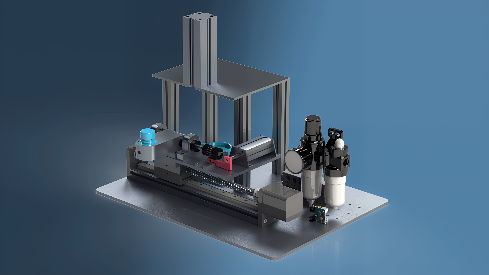
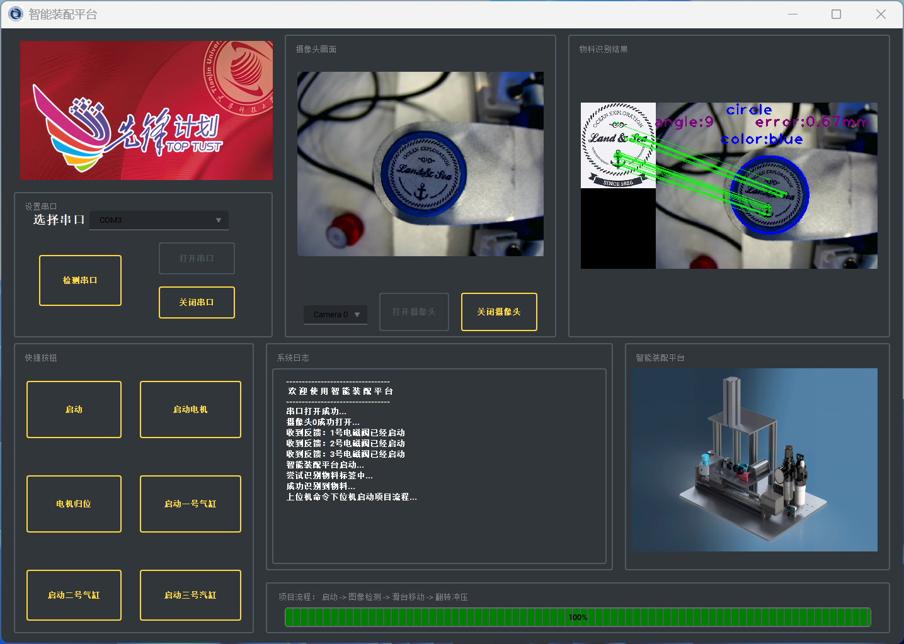

# SerialVisionUI

[](https://www.python.org/downloads/)
[](LICENSE)
[](https://www.riverbankcomputing.com/software/pyqt/)
[](https://opencv.org/)

> 🤖 基于PyQt5和OpenCV的全自动装配设备上位机控制系统

## 项目简介

SerialVisionUI是一个现代化的智能装配平台**上位机控制系统**，通过**计算机视觉**技术和**串口通信**实现对自动装配设备的精确控制。系统集成了实时图像识别、物料检测、装配流程监控等功能，为工业自动化提供了完整的解决方案。

### 主要特性

- **智能视觉识别**: 基于ORB算法的特征点匹配和HSV颜色空间检测
- **串口通信**: 高效稳定的下位机控制协议
- **现代化UI**: 基于PyQt5的直观用户界面，支持实时监控
- **实时监控**: 摄像头画面实时显示和识别结果可视化
- **模块化设计**: 良好的代码架构，易于维护和扩展
- **进度跟踪**: 装配流程进度实时显示和日志记录

## 项目结构

```
SerialVisionUI/
├── src/                          # 源代码目录
│   └── serial_vision_ui/         # 主包
│       ├── ui/                   # UI界面模块
│       ├── vision/               # 计算机视觉模块
│       ├── communication/        # 通信模块
│       ├── utils/                # 工具类模块
│       └── main_application.py      # 主应用程序
├── assets/                       # 资源文件
│   ├── images/                   # 图像资源
│   ├── icons/                    # 图标资源
│   ├── ui/                       # UI文件
│   └── libs/                     # 打包补丁
├── tests/                        # 测试文件
├── app.py                           # 程序入口
├── config.ini                       # 配置文件
├── requirements.txt                 # 依赖包列表
├── setup.py                         # 安装配置
└── README.md                        # 项目文档
```
## 效果展示
- 智能装配平台（实物部分渲染）:




- 上位机界面运行效果:




## 快速开始

### 环境要求

- **Python**: 3.8+
- **操作系统**: Windows 10/11
- **硬件**: 支持USB摄像头和串口设备

### 安装步骤

1. **克隆项目**
```bash
git clone https://github.com/User-o2/SerialVisionUI.git
cd SerialVisionUI
```

2. **创建虚拟环境**
```bash
conda create -n env_name python=3.11
```

3. **安装依赖**
```bash
pip install -r requirements.txt
```

4. **运行程序**
```bash
python app.py
```

### 开发环境安装

```bash
pip install -e .[dev]
```

## 功能模块

### 计算机视觉模块 (`vision/`)

- **特征匹配**: 基于ORB算法的鲁棒特征点匹配
- **颜色检测**: HSV颜色空间的红蓝物料识别
- **形状检测**: 霍夫圆检测算法计算形位公差

### 通信模块 (`communication/`)

- **串口管理**: 自动检测和管理串口设备
- **协议处理**: 标准化的上下位机通信协议
- **实时监控**: 数据收发状态实时监控

### UI模块 (`ui/`)

- 主界面: 现代化的操作界面设计
- 实时显示: 摄像头画面和识别结果同步显示
- 控制面板: 直观的设备控制按钮组
- 日志系统: 详细的操作日志和状态信息

### 工具模块 (`utils/`)

- 资源管理: 统一的资源文件路径管理
- 日志处理: 标准化的日志输出重定向
- 配置管理: 灵活的系统参数配置

## 使用指南

### 硬件连接

1. 摄像头: 连接USB摄像头到计算机
2. 串口设备: 通过串口连接下位机控制器
3. 检查连接: 在软件中检测设备是否正常识别

### 软件操作

1. 启动程序: 运行 `python app.py`
2. 设备检测: 点击"检测串口"检查硬件连接
3. 打开摄像头: 选择摄像头设备并点击"打开摄像头"
4. 开始识别: 点击"启动"开始图像识别和装配流程
5. 监控进度: 通过进度条和日志窗口监控装配状态

### 控制面板

- 启动: 开始整个装配流程
- 电机控制: 电机启动和归位操作
- 气缸控制: 三个气缸的独立控制
- 串口管理: 串口的开启和关闭

## 测试

运行测试套件：

```bash
# 运行所有测试
python -m pytest tests/

# 运行特定测试
python tests/test_vision_functions.py
```

## 打包部署

### 创建可执行文件

```bash
pyinstaller main.spec
```

### 自定义打包配置

编辑 `main.spec` 文件以自定义打包选项：

- 图标设置
- 资源文件包含
- 第三方库配置

## 配置说明

主要配置文件：`config.ini`

```ini
[serial]
baudrate = 9600          # 串口波特率
timeout = 1              # 超时时间

[camera] 
frame_interval = 30      # 帧更新间隔

[vision]
min_match_count = 30     # 最小特征匹配数
match_threshold = 0.75   # 匹配阈值
```

## 免责声明

- 本项目仅供学习和研究使用，不提供任何形式的商业支持和保证。
- 本仓库目前仅开源**本人负责部分**，PCB 电控与机械结构暂不公开。

## 致谢

- **项目组**: Group7
- **技术支持**: 感谢课程老师和项目组成员的协助

---

<div align="center">

**如果这个项目对您有帮助，请考虑给它一个 ⭐**

**Open source ❤️ Sharing**

————整理于2025.7月

</div>